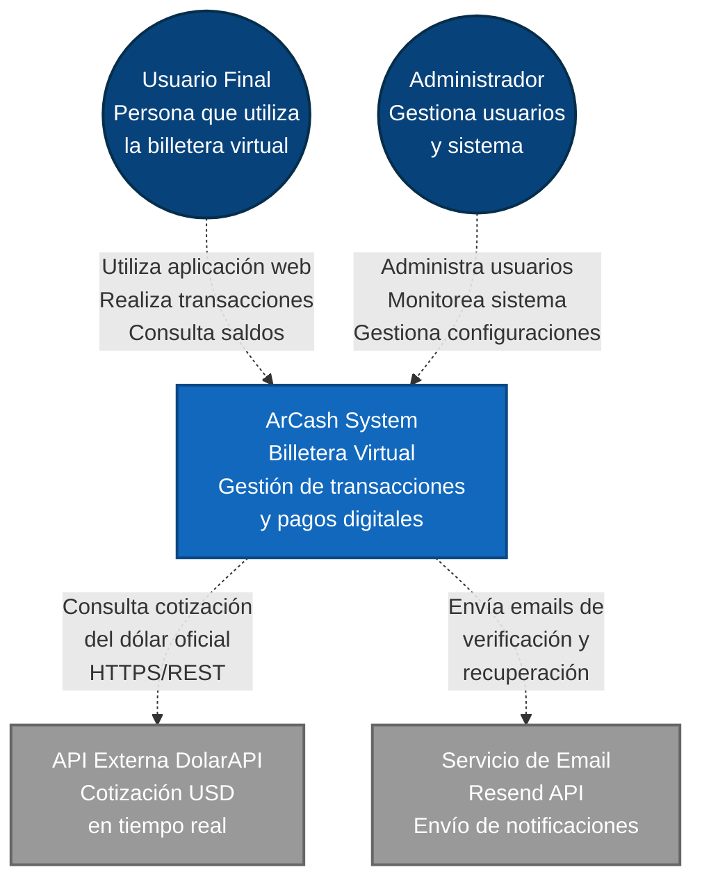

# Diagrama C1 - Contexto del Sistema

## ArCash### Sistemas Externos:
- **DolarAPI**: Proporciona cotización oficial del dólar argentino
- **Resend API**: Servicio de envío de emails para verificación y recuperación

### Tecnologías del Sistema:
- **Frontend**: Angular 20 con TypeScript (Puerto 4200)
- **Backend**: Spring Boot 3.4.5 con Java 21 (Puerto 8080)
- **Seguridad**: JWT + Spring Security
- **Base de Datos**: MySQL 8.0+ (interna al sistema)
- **Build**: Mavena Virtual

 Descripción del Sistema

ArCash es una aplicación de billetera virtual que permite a los usuarios:

 Funcionalidades Principales:
Gestión de Cuentas: Creación y administración de cuentas en pesos y dólares
Transacciones: Transferencias entre usuarios usando alias, CVU o QR
Autenticación Segura: Sistema de login con JWT y tokens de refresh
Gestión de Contactos: Favoritos para facilitar transferencias
-Conversión de Divisas: Integración con cotización oficial del dólar
Administración: Panel administrativo para gestión de usuarios

Actores:
Usuario Final: Personas que utilizan la billetera para transacciones
Administrador: Gestiona usuarios y monitorea el sistema

 Sistemas Externos:
DolarAPI: Proporciona cotización oficial del dólar argentino
Resend API: Servicio de envío de emails para verificación y recuperación
MySQL: Base de datos principal del sistema

Tecnologías:
Frontend: Angular 20 con TypeScript
Backend: Spring Boot 3.4.5 con Java 21
Seguridad: JWT + Spring Security
Base de Datos: MySQL 8.0+
Build: Maven
