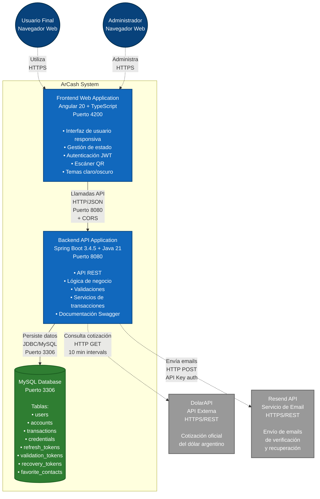

# Diagrama C2 - Contenedores del Sistema
## ArCash - Arquitectura de Contenedores

## Descripción de Contenedores

### Frontend Web Application (Angular 20)
**Tecnología**: Angular 20 + TypeScript  
**Puerto**: 4200  
**Responsabilidades**:
- Interfaz de usuario responsiva
- Gestión de autenticación con JWT
- Manejo de estado de la aplicación
- Escáner y generación de códigos QR
- Validaciones del lado cliente
- Temas claro/oscuro
- Interceptores HTTP para tokens
- Guards de rutas para seguridad

**Componentes principales**:
- `Dashboard`: Panel principal del usuario
- `Auth`: Login y registro
- `Transaction`: Gestión de transferencias
- `Admin`: Panel administrativo
- `Profile`: Gestión de perfil de usuario

### Backend API Application (Spring Boot)
**Tecnología**: Spring Boot 3.4.5 + Java 21  
**Puerto**: 8080 (acceso directo desde Frontend)  
**Responsabilidades**:
- API RESTful con endpoints seguros
- Autenticación y autorización JWT
- Lógica de negocio de transacciones
- Validaciones del lado servidor
- Gestión de sesiones y tokens
- Integración con APIs externas (DolarAPI, Resend)
- Configuración CORS para Frontend Angular
- Documentación Swagger/OpenAPI en `/swagger-ui.html`

**Principales módulos**:
- `Controller`: Endpoints REST (AuthController, UserController, etc.)
- `Service`: Lógica de negocio (UserService, TransactionService, etc.)
- `Repository`: Acceso a datos (JPA Repositories)
- `Security`: Configuración JWT y CORS
- `Models`: Entidades JPA (User, Account, Transaction, etc.)

### MySQL Database (Contenedor Interno)
**Tecnología**: MySQL 8.0+  
**Puerto**: 3306  
**Responsabilidades**:
- Almacenamiento persistente de datos del sistema ArCash
- Integridad referencial entre entidades
- Índices optimizados para consultas frecuentes
- Transacciones ACID para operaciones financieras

**Principales tablas**:
- `users`: Información de usuarios
- `accounts`: Cuentas en pesos y dólares
- `transactions`: Historial de transacciones
- `credentials`: Credenciales de acceso
- `refresh_tokens`: Tokens de refresh JWT
- `validation_tokens`: Tokens de validación de email
- `recovery_tokens`: Tokens de recuperación de contraseña
- `favorite_contacts`: Contactos favoritos del usuario

### Sistemas Externos

#### DolarAPI
- **Propósito**: Obtener cotización oficial del dólar argentino
- **Protocolo**: HTTPS/REST
- **Frecuencia**: Cada 10 minutos (configurable)
- **Endpoint**: `https://dolarapi.com/v1/dolares/oficial`

#### Resend API
- **Propósito**: Envío de emails transaccionales
- **Protocolo**: HTTPS/REST
- **Autenticación**: API Key
- **Uso**: Verificación de cuentas y recuperación de contraseñas
