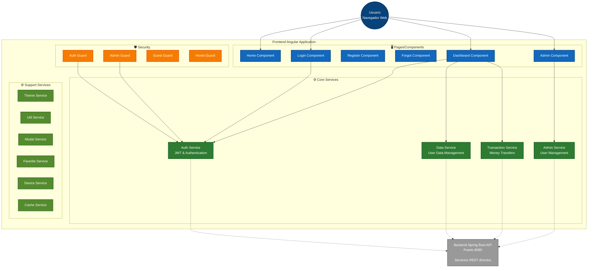

# Diagrama C3 - Componentes del Sistema
## ArCash - Arquitectura de Componentes Frontend



## ArCash - Arquitectura de Componentes Backend

```mermaid
graph TB
    %% Frontend (simplificado)
    Frontend[Frontend Angular<br/>Puerto 4200]
    
    %% Backend Application
    subgraph "Backend Spring Boot Application - Puerto 8080"
        subgraph "🌐 REST Controllers"
            AuthController[Auth Controller<br/>/api/auth/*]
            UserController[User Controller<br/>/api/user/*]
            TransactionController[Transaction Controller<br/>/api/transactions/*]
            AdminController[Admin Controller<br/>/api/admin/*]
            AccountController[Account Controller<br/>/api/accounts/*]
            FavoriteController[Favorite Controller<br/>/api/favorite/*]
            TaxController[Tax Controller<br/>/api/impuestos/*]
        end
        
        subgraph "🔧 Core Services"
            AuthService[Auth Service<br/>JWT & Authentication]
            UserService[User Service<br/>User Management]
            TransactionService[Transaction Service<br/>Money Operations]
            AccountService[Account Service<br/>Account Management]
            AdminService[Admin Service<br/>System Administration]
        end
        
        subgraph "🔧 Support Services"
            EmailService[Email Service<br/>Resend API]
            CotizationService[Cotization Service<br/>USD Exchange Rate]
            FavoriteService[Favorite contact Service<br/>Contact Management]
            ValidationTokenService[Validation Service<br/>Email Verification]
            RecoveryTokenService[Recovery Service<br/>Password Reset]
        end
        
        subgraph "🛡️ Security"
            JwtUtils[JWT Utils]
            JwtFilter[JWT Filter]
            SecurityConfig[Security Config]
            UserDetailsService[UserDetails Service]
        end
        
        subgraph "💾 Data Layer"
            UserRepo[User Repository]
            AccountRepo[Account Repository]
            TransactionRepo[Transaction Repository]
            CredentialRepo[Credential Repository]
            TokenRepos[Token Repositories<br/>Refresh, Validation, Recovery]
            FavoriteRepo[Favorite contact Repository]
        end
    end
    
    %% External Systems
    DolarAPI[DolarAPI<br/>USD Exchange]
    ResendAPI[Resend API<br/>Email Service]
    MySQL[(MySQL Database)]
    
    %% Conexiones principales simplificadas
    Frontend -.->|HTTP/JSON<br/>Puerto 8080<br/>CORS enabled| AuthController
    Frontend -.->|JWT Auth| UserController
    Frontend -.->|JWT Auth| TransactionController
    Frontend -.->|Admin Auth| AdminController
    
    %% Controllers to Core Services
    AuthController --> AuthService
    UserController --> UserService
    TransactionController --> TransactionService
    AdminController --> AdminService
    AccountController --> AccountService
    
    %% Core Services to Data
    AuthService --> UserRepo
    AuthService --> CredentialRepo
    UserService --> UserRepo
    TransactionService --> TransactionRepo
    TransactionService --> AccountRepo
    AccountService --> AccountRepo
    AdminService --> UserRepo
    FavoriteService --> FavoriteRepo
    
    %% Security Flow
    JwtFilter --> JwtUtils
    JwtFilter --> UserDetailsService
    UserDetailsService --> CredentialRepo
    
    %% External Integrations
    EmailService -.-> ResendAPI
    CotizationService -.-> DolarAPI
    
    %% Support Services to Controllers
    EmailService --> AuthController
    ValidationTokenService --> AuthController
    RecoveryTokenService --> AuthController
    CotizationService --> TaxController
    FavoriteService --> FavoriteController
    
    %% Database
    UserRepo --> MySQL
    AccountRepo --> MySQL
    TransactionRepo --> MySQL
    CredentialRepo --> MySQL
    TokenRepos --> MySQL
    FavoriteRepo --> MySQL
    
    %% Estilos
    classDef frontend fill:#1168bd,stroke:#0b4884,stroke-width:2px,color:#fff
    classDef gateway fill:#ff6f00,stroke:#e65100,stroke-width:2px,color:#fff
    classDef controller fill:#2e7b32,stroke:#1b5e20,stroke-width:2px,color:#fff
    classDef coreService fill:#1976d2,stroke:#0d47a1,stroke-width:2px,color:#fff
    classDef supportService fill:#3f51b5,stroke:#283593,stroke-width:2px,color:#fff
    classDef security fill:#f57c00,stroke:#e65100,stroke-width:2px,color:#fff
    classDef data fill:#6a1b9a,stroke:#4a148c,stroke-width:2px,color:#fff
    classDef external fill:#999999,stroke:#666666,stroke-width:2px,color:#fff
    classDef database fill:#2f7e32,stroke:#1b5e20,stroke-width:2px,color:#fff
    
    class Frontend frontend
    class APIGateway gateway
    class AuthController,UserController,TransactionController,AdminController,AccountController,FavoriteController,TaxController controller
    class AuthService,UserService,TransactionService,AccountService,AdminService coreService
    class EmailService,CotizationService,FavoriteService,ValidationTokenService,RecoveryTokenService supportService
    class JwtUtils,JwtFilter,SecurityConfig,UserDetailsService security
    class UserRepo,AccountRepo,TransactionRepo,CredentialRepo,TokenRepos,FavoriteRepo data
    class DolarAPI,ResendAPI external
    class MySQL database
```



## Descripción de Componentes

### 🖥️ Frontend Angular Components

#### **Home Component**
- **Propósito**: Página de inicio y landing page
- **Funcionalidades**: Navegación inicial, información del app
- **Dependencias**: AuthService para verificar estado de login

#### **Login Component** 
- **Propósito**: Autenticación de usuarios
- **Funcionalidades**: Login con username/password, recordar sesión
- **Dependencias**: AuthService para gestión de tokens JWT

#### **Dashboard Component**
- **Propósito**: Panel principal del usuario autenticado
- **Funcionalidades**: 
  - Consulta de saldo y datos de cuenta
  - Realizar transferencias (por alias, CVU, QR)
  - Escáner de códigos QR
  - Historial de transacciones
  - Gestión de contactos favoritos
- **Dependencias**: AuthService, DataService, TransactionService

#### **Admin Component**
- **Propósito**: Panel administrativo para gestión del sistema
- **Funcionalidades**: CRUD de usuarios, deshabilitación de cuentas
- **Dependencias**: AdminService, validación de rol admin

### ⚙️ Frontend Services

#### **Auth Service**
- **Responsabilidades**:
  - Gestión de tokens JWT (access + refresh)
  - Login/logout de usuarios
  - Refresh automático de tokens
  - Verificación de estado de autenticación
- **APIs utilizadas**: `/api/auth/*`

#### **Data Service**
- **Responsabilidades**:
  - Obtener datos del usuario autenticado
  - Gestionar información de cuentas
  - Cache local de datos frecuentemente usados
- **APIs utilizadas**: `/api/user/*`

#### **Transaction Service**
- **Responsabilidades**:
  - Procesar transferencias entre usuarios
  - Validaciones del lado cliente
  - Obtener historial de transacciones
- **APIs utilizadas**: `/api/transaction/*`

#### **Admin Service**
- **Responsabilidades**:
  - Operaciones administrativas
  - Gestión de usuarios (habilitar/deshabilitar)
  - Validaciones de permisos administrativos
- **APIs utilizadas**: `/api/admin/*`

### 🛡️ Frontend Security

#### **Auth Guard**
- **Propósito**: Protege rutas que requieren autenticación
- **Lógica**: Verifica JWT válido antes de permitir acceso

#### **Admin Guard**
- **Propósito**: Protege rutas administrativas
- **Lógica**: Verifica JWT + rol de administrador

#### **Auth Interceptor**
- **Propósito**: Añade automáticamente JWT a requests HTTP
- **Funcionalidades**: Manejo de errores 401, refresh automático

---

### 🌐 Backend Controllers (REST API)

#### **Auth Controller** (`/api/auth/*`)
- **Endpoints principales**:
  - `POST /login` - Autenticación de usuarios
  - `POST /logout` - Cerrar sesión
  - `POST /refresh` - Renovar tokens JWT
- **Responsabilidades**: Gestión de sesiones y autenticación

#### **User Controller** (`/api/user/*`)
- **Endpoints principales**:
  - `GET /profile` - Obtener datos del usuario
  - `PUT /profile` - Actualizar información personal
  - `POST /create` - Registro de nuevos usuarios
- **Responsabilidades**: CRUD de usuarios y perfiles

#### **Transaction Controller** (`/api/transaction/*`)
- **Endpoints principales**:
  - `POST /transfer` - Realizar transferencia
  - `GET /history` - Historial de transacciones
  - `GET /details/{id}` - Detalles de transacción
- **Responsabilidades**: Gestión de transferencias monetarias

#### **Admin Controller** (`/api/admin/*`)
- **Endpoints principales**:
  - `GET /users` - Listar todos los usuarios
  - `PUT /users/{id}/disable` - Deshabilitar usuario
  - `PUT /users/{id}/enable` - Habilitar usuario
- **Responsabilidades**: Operaciones administrativas

### 🔧 Backend Services (Business Logic)

#### **Auth Service**
- **Responsabilidades**:
  - Validación de credenciales
  - Generación y verificación de tokens JWT
  - Gestión de refresh tokens
  - Autenticación y autorización

#### **User Service**
- **Responsabilidades**:
  - CRUD de usuarios
  - Validaciones de datos
  - Gestión de verificación por email
  - Lógica de negocio de perfiles

#### **Transaction Service**
- **Responsabilidades**:
  - Procesamiento de transferencias
  - Validaciones de saldo y límites
  - Gestión de estados de transacción
  - Cálculo de comisiones

#### **Email Service**
- **Responsabilidades**:
  - Envío de emails de verificación
  - Emails de recuperación de contraseña
  - Notificaciones de transacciones
  - Integración con Resend API

#### **Cotization Service**
- **Responsabilidades**:
  - Consulta automática de cotización USD
  - Cache de valores para optimización
  - Integración con DolarAPI
  - Actualización periódica (10 minutos)

### 🛡️ Backend Security

#### **JWT Utils**
- **Funcionalidades**:
  - Generación de tokens JWT
  - Validación y verificación de tokens
  - Extracción de claims del usuario

#### **JWT Filter**
- **Propósito**: Filtro automático de autenticación
- **Funcionamiento**: Intercepta requests, valida JWT, establece contexto de seguridad

#### **Security Config**
- **Configuraciones**:
  - CORS para comunicación con frontend
  - Endpoints públicos vs protegidos
  - Configuración de sesiones stateless

### 💾 Backend Data Layer

#### **Repositories (JPA)**
- **User Repository**: Operaciones CRUD sobre tabla `users`
- **Account Repository**: Gestión de cuentas y saldos
- **Transaction Repository**: Historial y consultas de transacciones
- **Token Repositories**: Gestión de tokens de refresh, validación y recuperación

#### **Entities (Models)**
- **User**: Datos personales del usuario
- **Account**: Información de cuentas (saldos, CVU, alias)
- **Transaction**: Registros de transferencias
- **Credentials**: Información de autenticación
- **Tokens**: Diferentes tipos de tokens del sistema

---

## 🔄 Flujos de Funcionamiento

### **1. Flujo de Autenticación**
```
Login Component → Auth Service → Auth Controller → 
Auth Service (Backend) → User Repository → JWT Generation → 
Response with tokens → Frontend storage → Auto-refresh setup
```

### **2. Flujo de Transferencia**
```
Dashboard Component → Transaction Service → Transaction Controller → 
Transaction Service (Backend) → Validations → Account Repository → 
Transaction Repository → Email notifications → Response
```

### **3. Flujo de Administración**
```
Admin Component → Admin Guard → Admin Service → Admin Controller → 
Admin Service (Backend) → Role validation → User Repository → 
CRUD operations → Response
```

### **4. Flujo de Cotización USD**
```
Scheduled job (10 min) → Cotization Service → DolarAPI → 
Cache update → Available for Tax Controller → Frontend requests
```
