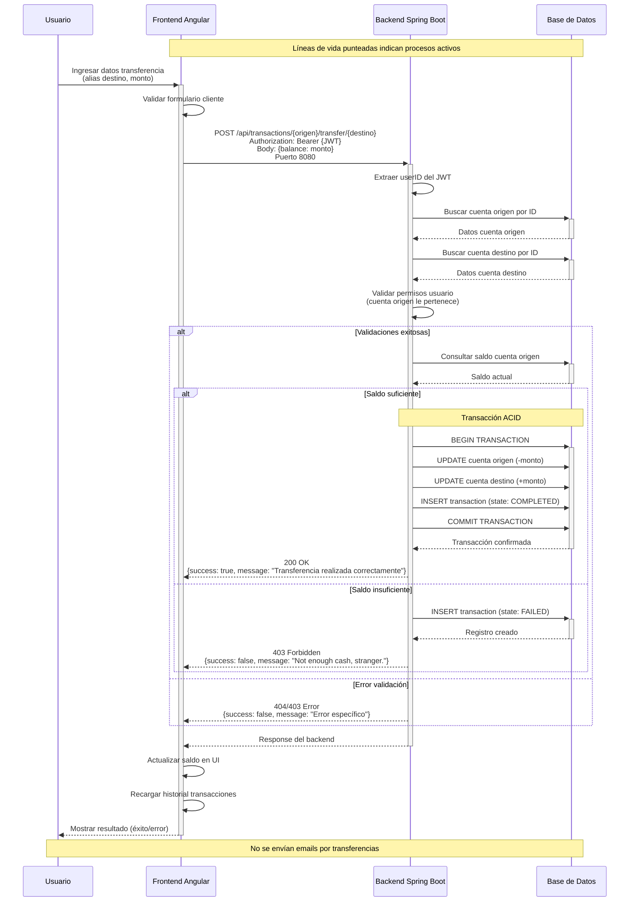
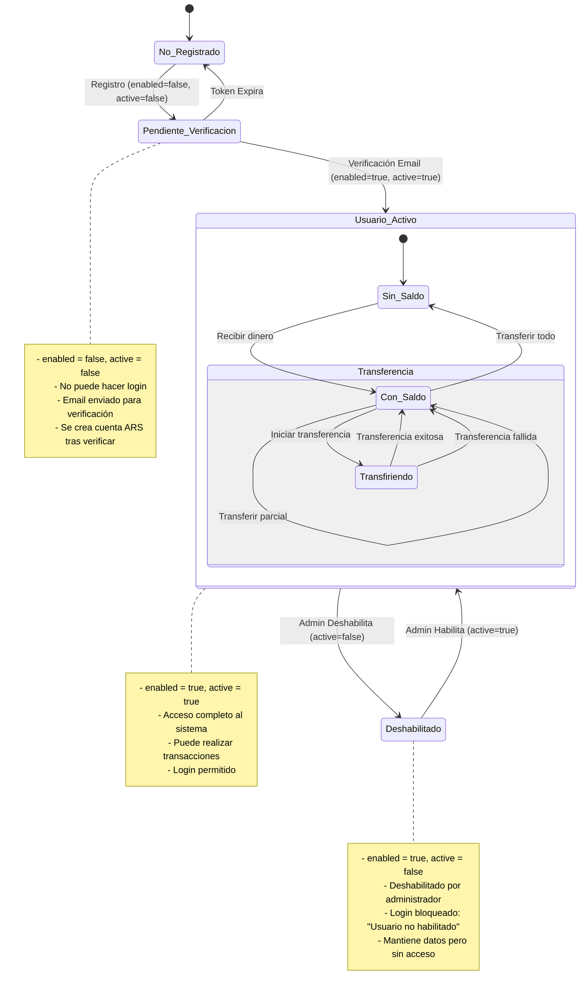

# Diagramas UML - ArCash Billetera Virtual

## 1. Diagrama de Casos de Uso

```mermaid
graph TD
    %% Actores
    Usuario((Usuario))
    Admin((Administrador))
    DolarAPI((DolarAPI))
    ResendAPI((Resend API))
    
    %% Sistema
    subgraph "ArCash System"
        %% Casos de uso principales de usuario
        UC1[Registrarse]
        UC2[Iniciar Sesión]
        UC3[Verificar Email]
        UC4[Consultar Saldo]
        UC5[Transferir Dinero]
        UC6[Buscar Cuenta por Alias/CVU]
        UC7[Generar QR para Cobro]
        UC8[Escanear QR]
        UC9[Ver Historial Transacciones]
        UC10[Agregar Contacto Favorito]
        UC11[Gestionar Favoritos]
        UC12[Cambiar Alias]
        UC13[Calcular Impuestos ARS/USD]
        UC14[Recuperar Contraseña]
        UC15[Ingresar Dinero]
        
        %% Casos de uso administrativos
        UC16[Gestionar Usuarios]
        UC17[Ver Reportes Sistema]
        UC18[Habilitar/Deshabilitar Usuarios]
        
        %% Casos de uso del sistema
        UC19[Consultar Cotización USD]
        UC20[Enviar Email Verificación]
        UC21[Enviar Email Recuperación]
    end
    
    %% Relaciones Usuario
    Usuario --> UC1
    Usuario --> UC2
    Usuario --> UC3
    Usuario --> UC4
    Usuario --> UC5
    Usuario --> UC6
    Usuario --> UC7
    Usuario --> UC8
    Usuario --> UC9
    Usuario --> UC10
    Usuario --> UC11
    Usuario --> UC12
    Usuario --> UC13
    Usuario --> UC14
    Usuario --> UC15
    
    %% Relaciones Admin
    Admin --> UC2
    Admin --> UC16
    Admin --> UC17
    Admin --> UC18
    
    %% Relaciones Sistemas Externos
    DolarAPI --> UC19
    ResendAPI --> UC20
    ResendAPI --> UC21
    
    %% Relaciones Include/Extend
    UC1 -.->|include| UC20
    UC14 -.->|include| UC21
    UC5 -.->|include| UC2
    UC4 -.->|include| UC2
    UC9 -.->|include| UC2
    UC13 -.->|include| UC19
    
    %% Estilos
    classDef person fill:#08427b,stroke:#052e4b,stroke-width:2px,color:#fff
    classDef system fill:#1168bd,stroke:#0b4884,stroke-width:2px,color:#fff
    classDef external fill:#999999,stroke:#666666,stroke-width:2px,color:#fff
    
    class Usuario,Admin person
    class UC1,UC2,UC3,UC4,UC5,UC6,UC7,UC8,UC9,UC10,UC11,UC12,UC13,UC14,UC15,UC16,UC17,UC18,UC19,UC20,UC21 system
    class DolarAPI,ResendAPI external
```



**Descripción:**
- **Usuario**: Persona que usa la billetera para transacciones financieras
- **Administrador**: Gestiona usuarios y monitorea el sistema
- **DolarAPI**: Sistema externo para cotización del dólar
- **Resend API**: Sistema externo para envío de emails (solo verificación y recuperación)

**Nota importante**: Las transferencias NO generan notificaciones por email

**Explicación del Diagrama:**

Este diagrama muestra las funcionalidades principales de ArCash desde la perspectiva de los usuarios. Tenemos tres actores principales: el Usuario final, el Administrador, y dos sistemas externos - DolarAPI y Resend API.

Los usuarios pueden realizar 15 operaciones principales como registrarse, iniciar sesión, transferir dinero, consultar saldo, y gestionar contactos favoritos. Los administradores tienen acceso adicional para gestionar usuarios y ver reportes del sistema.

Es importante destacar las relaciones 'include' - por ejemplo, cuando un usuario se registra, automáticamente se incluye el envío de email de verificación. Y cuando realiza transferencias, necesariamente debe estar autenticado.

Los sistemas externos DolarAPI y Resend API son fundamentales: DolarAPI nos proporciona la cotización del dólar para los cálculos de impuestos, y Resend API maneja únicamente los emails de verificación y recuperación de contraseña - no se envían emails por transferencias.

---

## 2. Diagrama de Secuencia - Transferir Dinero



**Explicación del Diagrama:**

Este diagrama muestra el flujo temporal detallado de una transferencia de dinero entre usuarios. Es el proceso más crítico del sistema por manejar transacciones financieras.

El proceso inicia cuando el usuario ingresa los datos en el frontend Angular. Primero se valida el formulario del lado cliente, luego se envía una petición POST al backend Spring Boot en el puerto 8080.

El backend realiza múltiples validaciones de seguridad: extrae el userID del token JWT, verifica que las cuentas origen y destino existan, y crucialmente, valida que el usuario sea dueño de la cuenta origen para prevenir transferencias no autorizadas.

Si todo es válido, se ejecuta una transacción ACID en la base de datos: se resta el monto de la cuenta origen, se suma a la cuenta destino, y se registra la operación con estado 'COMPLETED'. Si hay saldo insuficiente, se registra como 'FAILED' pero no se mueve dinero.

Note que no se envían emails por transferencias - solo se muestran notificaciones toast en el frontend.

---

## 3. Diagrama de Estados - Cuenta de Usuario



**Estados Principales:**

### Estados de Usuario
- **No Registrado**: Usuario no existe en el sistema
- **Pendiente Verificación**: Usuario creado pero no verificado (enabled=false, active=false)
- **Usuario Activo**: Usuario verificado y habilitado (enabled=true, active=true)
- **Deshabilitado**: Usuario deshabilitado por administrador (enabled=true, active=false)

### Estados de Saldo
- **Sin Saldo**: $0 en la cuenta ARS
- **Con Saldo**: Dinero disponible para transferir
- **Transfiriendo**: Procesando transferencia (validaciones + transacción ACID)

**Explicación del Diagrama:**

Este diagrama representa el ciclo de vida completo de una cuenta de usuario en ArCash, basado en dos campos booleanos del modelo User: 'enabled' y 'active'.

Un usuario inicia como 'No Registrado'. Al registrarse, pasa a 'Pendiente Verificación' con enabled=false y active=false. En este estado no puede hacer login y debe verificar su email.

Una vez verificado el email, se activa completamente: enabled=true y active=true, convirtiéndose en 'Usuario Activo'. Solo en este estado puede realizar transacciones y usar todas las funcionalidades.

Los administradores pueden deshabilitar usuarios, cambiando solo el campo active=false. Esto los lleva al estado 'Deshabilitado' donde mantienen sus datos pero no pueden acceder al sistema.

Dentro del estado activo, manejamos sub-estados de saldo: Sin Saldo, Con Saldo, y Transfiriendo durante el procesamiento de operaciones. Este diseño refleja exactamente la implementación real del código sin funcionalidades ficticias.

---

## 4. Diagrama de Actividades - Proceso de Registro


**Explicación del Diagrama:**

Este diagrama muestra el flujo de trabajo completo del registro de usuarios, que es el proceso de onboarding más importante del sistema.

El proceso inicia cuando el usuario completa el formulario de registro. Se realizan validaciones tanto del lado cliente como servidor: formato de email, unicidad de datos, y longitud de campos.

Si el email ya existe, se muestra el error y debe intentar con otro. Si todo es válido, se crea el usuario en la base de datos con estado inactivo, se genera un token de verificación, y se envía automáticamente un email usando Resend API.

El usuario debe hacer clic en el enlace del email para activar su cuenta. Si el token es válido, se activa la cuenta, se crea automáticamente una cuenta ARS con saldo cero, se genera un alias único, y se envía un email de bienvenida.

Si el token expira o es inválido, el usuario puede solicitar un reenvío del email. Este flujo garantiza que solo emails válidos puedan usar el sistema y mejora la seguridad general.

---

## 5. Diseño de Condiciones de Prueba - Caja Negra

### Endpoint: POST /api/transactions/{idOrigen}/transfer/{idDestino}

| **ID** | **Condición de Prueba** | **Datos de Entrada** | **Resultado Esperado** |
|--------|------------------------|---------------------|----------------------|
| TC001 | Transferencia válida exitosa | idOrigen: 1, idDestino: 2, amount: 1000, saldo: 5000, JWT válido | HTTP 200, {success: true, message: "Transferencia realizada correctamente"} |
| TC002 | Saldo insuficiente | idOrigen: 1, idDestino: 2, amount: 1000, saldo: 500, JWT válido | HTTP 403, {success: false, message: "Not enough cash, stranger."} |
| TC003 | Cuenta origen inexistente | idOrigen: 999, idDestino: 2, amount: 1000, JWT válido | HTTP 404, {success: false, message: "No se pudo encontrar la cuenta de orig."} |
| TC004 | Cuenta destino inexistente | idOrigen: 1, idDestino: 999, amount: 1000, JWT válido | HTTP 404, {success: false, message: "No se pudo encontrar la cuenta de orig."} |
| TC005 | Transferencia a sí mismo | idOrigen: 1, idDestino: 1, amount: 1000, JWT válido | HTTP 200, Transaction registrada con state: "FAILED" |
| TC006 | Monto negativo | idOrigen: 1, idDestino: 2, amount: -100, JWT válido | Transacción no se ejecuta, return false |
| TC007 | Monto cero | idOrigen: 1, idDestino: 2, amount: 0, JWT válido | Transacción no se ejecuta, return false |
| TC008 | JWT no proporcionado | Sin header Authorization | HTTP 498, {success: false, message: "Token no valido"} |
| TC009 | JWT inválido | Authorization: "Bearer token_invalido" | HTTP 498, {success: false, message: "Token inválido o nulo"} |
| TC010 | Usuario no es dueño de cuenta origen | idOrigen: 2 (de otro usuario), JWT válido userID: 1 | HTTP 403, {success: false, message: "No tiene permiso para operar esta cuenta"} |

### Endpoint: GET /api/transactions/search/{input}

| **ID** | **Condición de Prueba** | **Datos de Entrada** | **Resultado Esperado** |
|--------|------------------------|---------------------|----------------------|
| TC011 | Búsqueda por alias válido | input: "juan.perez.arcash" | HTTP 200, datos completos del usuario y cuenta |
| TC012 | Búsqueda por CVU válido | input: "1234567890123456789012" | HTTP 200, datos completos del usuario y cuenta |
| TC013 | Alias inexistente | input: "usuario.inexistente" | HTTP 404, {error: "Cuenta no encontrada."} |
| TC014 | CVU inexistente | input: "0000000000000000000000" | HTTP 404, {error: "Cuenta no encontrada."} |
| TC015 | Input vacío | input: "" | HTTP 404, {error: "Cuenta no encontrada."} |

### Técnicas de Caja Negra Aplicadas:
- **Partición de Equivalencia**: Saldos suficientes/insuficientes, tokens válidos/inválidos, cuentas existentes/inexistentes
- **Análisis de Valores Límite**: Montos en 0, negativos, transferencias a sí mismo
- **Análisis de Errores**: Casos de autenticación, autorización y validación
- **Pruebas de Seguridad**: Validación de JWT y permisos de cuenta

**Explicación del Diagrama:**

Estas tablas documentan nuestro enfoque de testing de caja negra para los endpoints más críticos del sistema.

Para el endpoint de transferencias, diseñamos 10 casos que cubren: transferencias exitosas, validaciones de saldo, cuentas inexistentes, transferencias a uno mismo, montos inválidos, y diferentes escenarios de autenticación y autorización.

Para el endpoint de búsqueda de cuentas, probamos búsquedas por alias y CVU, tanto existentes como inexistentes, incluyendo casos límite como inputs vacíos.

Aplicamos técnicas de partición de equivalencia para agrupar inputs similares, análisis de valores límite para casos extremos, y pruebas específicas de seguridad para validar JWT y permisos.

Este enfoque sistemático nos permite validar que el sistema se comporta correctamente tanto en casos exitosos como en situaciones de error, garantizando la robustez y seguridad de las operaciones financieras.

---

## 6. Prueba del Sistema - Flujo Completo E2E

### Escenario: Usuario Nuevo Realiza Primera Transferencia

```gherkin
Feature: Transferencia de dinero entre usuarios de ArCash
  Como usuario nuevo de ArCash
  Quiero poder registrarme y realizar mi primera transferencia por alias
  Para comenzar a usar la billetera virtual

Scenario: Registro exitoso y primera transferencia
  Given el usuario accede a la aplicación ArCash en localhost:4200
  When completa el formulario de registro con datos válidos
    | email    | juan.perez@email.com |
    | password | MiPassword123!       |
    | nombre   | Juan                 |
    | apellido | Pérez                |
    | dni      | 12345678             |
  And hace clic en "Registrarse"
  Then el sistema crea el usuario con estado "Pendiente_Verificacion"
  And se crea automáticamente una cuenta ARS con saldo $0
  And se genera un alias único "juan.perez.arcash"
  And recibe un email de verificación de Resend API
  
  When hace clic en el enlace de verificación del email
  Then su cuenta cambia a estado "Activa"
  And puede iniciar sesión exitosamente
  
  When inicia sesión con sus credenciales
  Then accede al dashboard principal
  And puede ver su saldo inicial de $0.00
  And puede ver su alias "juan.perez.arcash"
  
  # Simular ingreso de dinero (usuarios y admins pueden usar este endpoint)
  Given el usuario ingresa $10,000 a su cuenta usando el endpoint interno
  When el usuario refresca el dashboard
  Then puede ver su nuevo saldo de $10,000.00
  
  When selecciona "Transferir dinero" 
  And ingresa el alias del destinatario "maria.gonzalez.arcash"
  And hace clic en "Buscar cuenta"
  Then ve los datos del destinatario: "María González - DNI: 87654321"
  
  When ingresa el monto $2,500
  And hace clic en "Confirmar transferencia"
  Then ve el mensaje "Transferencia realizada con éxito" (toast)
  And su saldo se actualiza a $7,500.00 en tiempo real
  And la transacción aparece en el historial con estado "COMPLETED"
  And NO recibe email de confirmación (solo toast notification)
  
  When consulta su historial de transacciones
  Then puede ver la transferencia registrada con:
    | Campo     | Valor                    |
    | Destino   | maria.gonzalez.arcash   |
    | Monto     | -$2,500.00              |
    | Estado    | COMPLETED               |
    | Fecha     | [timestamp actual]       |
```

### Criterios de Aceptación:
1. Registro completo en menos de 1 minuto
2. Email de verificación llega en menos de 30 segundos  
3. Búsqueda de cuenta por alias responde en menos de 2 segundos
4. Transferencia se procesa en menos de 3 segundos
5. Saldos se actualizan en tiempo real (sin refresh manual)
6. Historial se actualiza automáticamente post-transferencia
7. Transacciones quedan registradas con estados correctos
8. NO se envían emails por transferencias (solo toasts)

### Ambiente de Prueba:
- **Frontend**: Angular en http://localhost:4200
- **Backend**: Spring Boot en http://localhost:8080
- **Base de Datos**: MySQL con datos de prueba limpios
- **Email Service**: Resend API configurado para ambiente testing
- **Navegador**: Chrome/Firefox con DevTools para monitoreo

### Endpoints Principales Utilizados:
- `POST /api/user/create` - Registro de usuario
- `POST /api/auth/login` - Autenticación
- `GET /api/transactions/search/{alias}` - Búsqueda de cuenta
- `POST /api/transactions/{origen}/transfer/{destino}` - Transferencia
- `GET /api/transactions/{id}/getTransactions` - Historial
- `PUT /api/accounts/{id}/balance` - Ingreso de dinero (usuarios y admins)

**Explicación del Diagrama:**

Este escenario de prueba end-to-end valida el journey completo de un usuario nuevo: desde el registro hasta su primera transferencia exitosa.

El escenario está escrito en formato Gherkin para mayor claridad. Comienza con un usuario que accede a localhost:4200, se registra con datos válidos, recibe y confirma el email de verificación, y automáticamente se le crea una cuenta ARS.

Luego simula el ingreso de dinero usando el endpoint PUT /api/accounts/{id}/balance, que pueden usar tanto usuarios como administradores. Una vez con saldo, busca un destinatario por alias, confirma los datos, y ejecuta la transferencia.

Los criterios de aceptación son específicos y medibles: registro en menos de 1 minuto, emails en menos de 30 segundos, búsquedas en menos de 2 segundos, y transferencias en menos de 3 segundos.

Este tipo de prueba nos asegura que toda la integración entre frontend Angular, backend Spring Boot, base de datos MySQL, y servicios externos funciona correctamente en un escenario real de uso.

---

