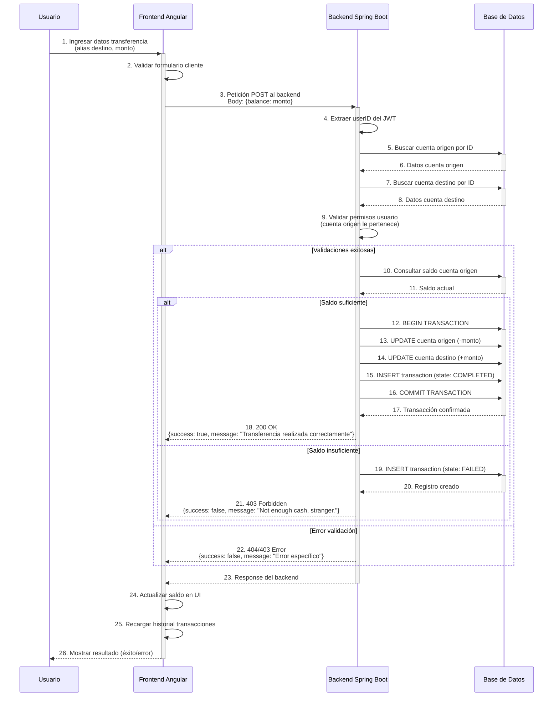
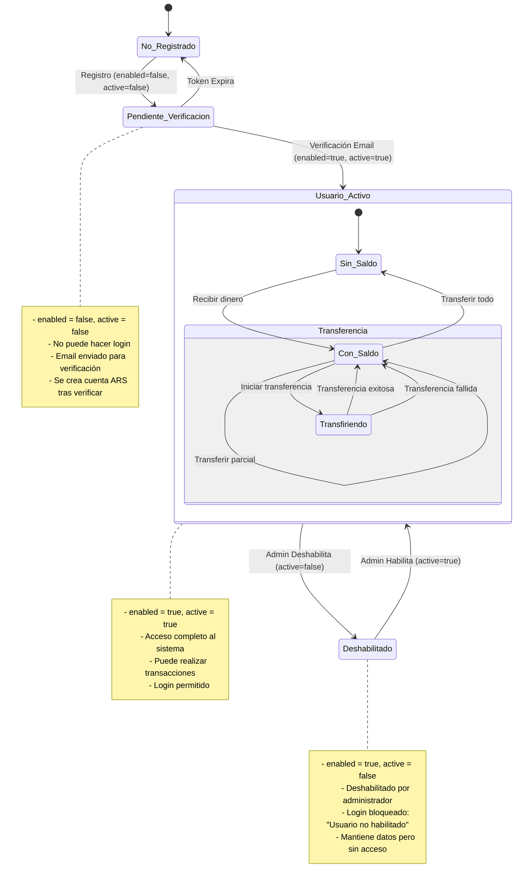
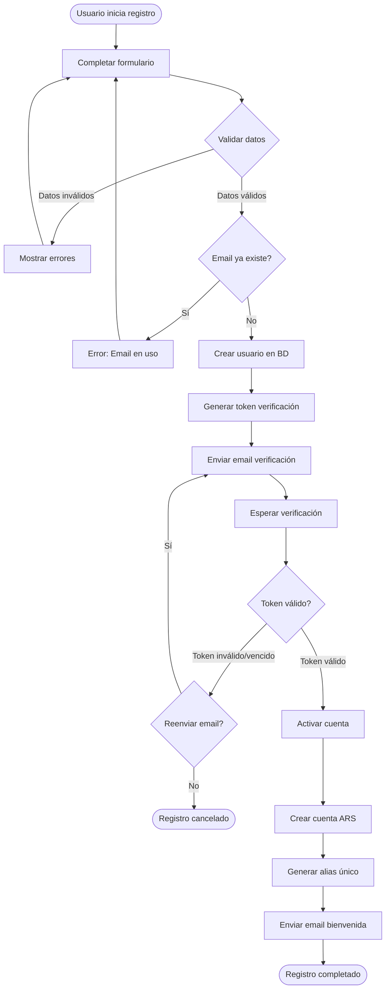
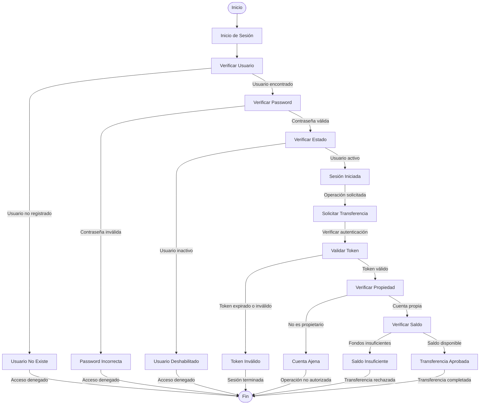

# Diagramas UML - ArCash Billetera Virtual

## 1. Diagrama de Casos de Uso

```mermaid
graph TD
    %% Actores
    Usuario((Usuario))
    Admin((Administrador))
    DolarAPI((DolarAPI))
    ResendAPI((Resend API))
    
    %% Relación de herencia
    Admin -.->|extends| Usuario
    
    %% Sistema
    subgraph "ArCash System"
        %% Casos de uso principales de usuario
        UC1[Registrarse]
        UC2[Iniciar Sesión]
        UC3[Verificar Email]
        UC4[Consultar Saldo]
        UC5[Transferir Dinero]
        UC6[Buscar Cuenta por Alias/CVU]
        UC7[Generar QR para Cobro]
        UC8[Escanear QR]
        UC9[Ver Historial Transacciones]
        UC10[Agregar Contacto Favorito]
        UC11[Gestionar Favoritos]
        UC12[Cambiar Alias]
        UC13[Calcular Impuestos ARS/USD]
        UC14[Recuperar Contraseña]
        UC15[Ingresar Dinero]
        
        %% Casos de uso administrativos exclusivos
        UC16[Gestionar Usuarios]
        UC17[Ver Reportes Sistema]
        UC18[Habilitar/Deshabilitar Usuarios]
        
        %% Casos de uso del sistema
        UC19[Consultar Cotización USD]
        UC20[Enviar Email Verificación]
        UC21[Enviar Email Recuperación]
    end
    
    %% Relaciones Usuario (posicionadas a la izquierda)
    Usuario --> UC1
    Usuario --> UC2
    Usuario --> UC3
    Usuario --> UC4
    Usuario --> UC5
    Usuario --> UC6
    Usuario --> UC7
    Usuario --> UC8
    Usuario --> UC9
    Usuario --> UC10
    Usuario --> UC11
    Usuario --> UC12
    Usuario --> UC13
    Usuario --> UC14
    Usuario --> UC15
    
    %% Relaciones Admin exclusivas (posicionadas a la derecha)
    Admin -.-> UC16
    Admin -.-> UC17
    Admin -.-> UC18
    
    %% Relaciones Sistemas Externos
    DolarAPI --> UC19
    ResendAPI --> UC20
    ResendAPI --> UC21
    
    %% Relaciones Include/Extend
    UC1 -.->|include| UC20
    UC14 -.->|include| UC21
    UC5 -.->|include| UC2
    UC4 -.->|include| UC2
    UC9 -.->|include| UC2
    UC13 -.->|include| UC19
    
    %% Estilos
    classDef person fill:#08427b,stroke:#052e4b,stroke-width:2px,color:#fff
    classDef admin fill:#d35400,stroke:#a0392f,stroke-width:3px,color:#fff
    classDef system fill:#1168bd,stroke:#0b4884,stroke-width:2px,color:#fff
    classDef adminSystem fill:#e67e22,stroke:#d35400,stroke-width:2px,color:#fff
    classDef external fill:#999999,stroke:#666666,stroke-width:2px,color:#fff
    
    class Usuario person
    class Admin admin
    class UC1,UC2,UC3,UC4,UC5,UC6,UC7,UC8,UC9,UC10,UC11,UC12,UC13,UC14,UC15,UC19,UC20,UC21 system
    class UC16,UC17,UC18 adminSystem
    class DolarAPI,ResendAPI external
```

**Descripción:**
- **Usuario**: Persona que usa la billetera para transacciones financieras
- **Administrador**: Extiende de Usuario - puede hacer todo lo que hace un usuario más funciones administrativas específicas
- **DolarAPI**: Sistema externo para cotización del dólar
- **Resend API**: Sistema externo para envío de emails (solo verificación y recuperación)

**Nota importante**: Las transferencias NO generan notificaciones por email

**Explicación del Diagrama:**

Este diagrama muestra las funcionalidades principales de ArCash desde la perspectiva de los usuarios. Tenemos dos actores principales: el Usuario final y el Administrador (que extiende de Usuario), y dos sistemas externos - DolarAPI y Resend API.

El Administrador hereda todas las capacidades de un Usuario regular (15 operaciones como registrarse, transferir dinero, consultar saldo, etc.) y además tiene acceso a 3 funcionalidades administrativas exclusivas: gestionar usuarios, ver reportes del sistema, y habilitar/deshabilitar usuarios.

Los usuarios pueden realizar 15 operaciones principales como registrarse, iniciar sesión, transferir dinero, consultar saldo, y gestionar contactos favoritos. Los administradores tienen acceso a estas mismas funcionalidades más las administrativas.

Es importante destacar las relaciones 'include' - por ejemplo, cuando un usuario se registra, automáticamente se incluye el envío de email de verificación. Y cuando realiza transferencias, necesariamente debe estar autenticado.

Los sistemas externos DolarAPI y Resend API son fundamentales: DolarAPI nos proporciona la cotización del dólar para los cálculos de impuestos, y Resend API maneja únicamente los emails de verificación y recuperación de contraseña - no se envían emails por transferencias.

---

## 2. Diagrama de Secuencia - Transferir Dinero

**Explicación del Diagrama:**

Este diagrama muestra el flujo temporal detallado de una transferencia de dinero entre usuarios. Es el proceso más crítico del sistema por manejar transacciones financieras.

El proceso inicia cuando el usuario ingresa los datos en el frontend Angular. Primero se valida el formulario del lado cliente, luego se envía una petición POST al backend Spring Boot en el puerto 8080.

El backend realiza múltiples validaciones de seguridad: extrae el userID del token JWT, verifica que las cuentas origen y destino existan, y crucialmente, valida que el usuario sea dueño de la cuenta origen para prevenir transferencias no autorizadas.

Si todo es válido, se ejecuta una transacción ACID en la base de datos: se resta el monto de la cuenta origen, se suma a la cuenta destino, y se registra la operación con estado 'COMPLETED'. Si hay saldo insuficiente, se registra como 'FAILED' pero no se mueve dinero.

Note que no se envían emails por transferencias - solo se muestran notificaciones toast en el frontend.

---

## 3. Diagrama de Estados - Cuenta de Usuario

**Estados Principales:**

### Estados de Usuario
- **No Registrado**: Usuario no existe en el sistema
- **Pendiente Verificación**: Usuario creado pero no verificado (enabled=false, active=false)
- **Usuario Activo**: Usuario verificado y habilitado (enabled=true, active=true)
- **Deshabilitado**: Usuario deshabilitado por administrador (enabled=true, active=false)

### Estados de Saldo
- **Sin Saldo**: $0 en la cuenta ARS
- **Con Saldo**: Dinero disponible para transferir
- **Transfiriendo**: Procesando transferencia (validaciones + transacción ACID)

**Explicación del Diagrama:**

Este diagrama representa el ciclo de vida completo de una cuenta de usuario en ArCash, basado en dos campos booleanos del modelo User: 'enabled' y 'active'.

Un usuario inicia como 'No Registrado'. Al registrarse, pasa a 'Pendiente Verificación' con enabled=false y active=false. En este estado no puede hacer login y debe verificar su email.

Una vez verificado el email, se activa completamente: enabled=true y active=true, convirtiéndose en 'Usuario Activo'. Solo en este estado puede realizar transacciones y usar todas las funcionalidades.

Los administradores pueden deshabilitar usuarios, cambiando solo el campo active=false. Esto los lleva al estado 'Deshabilitado' donde mantienen sus datos pero no pueden acceder al sistema.

Dentro del estado activo, manejamos sub-estados de saldo: Sin Saldo, Con Saldo, y Transfiriendo durante el procesamiento de operaciones. Este diseño refleja exactamente la implementación real del código sin funcionalidades ficticias.

---

## 4. Diagrama de Actividades - Proceso de Registro

**Explicación del Diagrama:**

Este diagrama muestra el flujo de trabajo completo del registro de usuarios, que es el proceso de onboarding más importante del sistema.

El proceso inicia cuando el usuario completa el formulario de registro. Se realizan validaciones tanto del lado cliente como servidor: formato de email, unicidad de datos, y longitud de campos.

Si el email ya existe, se muestra el error y debe intentar con otro. Si todo es válido, se crea el usuario en la base de datos con estado inactivo, se genera un token de verificación, y se envía automáticamente un email usando Resend API.

El usuario debe hacer clic en el enlace del email para activar su cuenta. Si el token es válido, se activa la cuenta, se crea automáticamente una cuenta ARS con saldo cero, se genera un alias único, y se envía un email de bienvenida.

Si el token expira o es inválido, el usuario puede solicitar un reenvío del email. Este flujo garantiza que solo emails válidos puedan usar el sistema y mejora la seguridad general.

---

## 5. Diseño de Condiciones de Prueba - Caja Negra

### Endpoint: POST /api/transactions/{idOrigen}/transfer/{idDestino}

| **ID** | **Condición de Prueba** | **Datos de Entrada** | **Resultado Esperado** |
|--------|------------------------|---------------------|----------------------|
| TC001 | Transferencia válida exitosa | idOrigen: 1, idDestino: 2, amount: 1000, saldo: 5000, JWT válido | HTTP 200, {success: true, message: "Transferencia realizada correctamente"} |
| TC002 | Saldo insuficiente | idOrigen: 1, idDestino: 2, amount: 1000, saldo: 500, JWT válido | HTTP 403, {success: false, message: "Not enough cash, stranger."} |
| TC003 | Cuenta origen inexistente | idOrigen: 999, idDestino: 2, amount: 1000, JWT válido | HTTP 404, {success: false, message: "No se pudo encontrar la cuenta de orig."} |
| TC004 | Cuenta destino inexistente | idOrigen: 1, idDestino: 999, amount: 1000, JWT válido | HTTP 404, {success: false, message: "No se pudo encontrar la cuenta de orig."} |
| TC005 | Transferencia a sí mismo | idOrigen: 1, idDestino: 1, amount: 1000, JWT válido | HTTP 200, Transaction registrada con state: "FAILED" |
| TC006 | Monto negativo | idOrigen: 1, idDestino: 2, amount: -100, JWT válido | Transacción no se ejecuta, return false |
| TC007 | Monto cero | idOrigen: 1, idDestino: 2, amount: 0, JWT válido | Transacción no se ejecuta, return false |
| TC008 | JWT no proporcionado | Sin header Authorization | HTTP 498, {success: false, message: "Token no valido"} |
| TC009 | JWT inválido | Authorization: "Bearer token_invalido" | HTTP 498, {success: false, message: "Token inválido o nulo"} |
| TC010 | Usuario no es dueño de cuenta origen | idOrigen: 2 (de otro usuario), JWT válido userID: 1 | HTTP 403, {success: false, message: "No tiene permiso para operar esta cuenta"} |

### Endpoint: GET /api/transactions/search/{input}

| **ID** | **Condición de Prueba** | **Datos de Entrada** | **Resultado Esperado** |
|--------|------------------------|---------------------|----------------------|
| TC011 | Búsqueda por alias válido | input: "juan.perez.arcash" | HTTP 200, datos completos del usuario y cuenta |
| TC012 | Búsqueda por CVU válido | input: "1234567890123456789012" | HTTP 200, datos completos del usuario y cuenta |
| TC013 | Alias inexistente | input: "usuario.inexistente" | HTTP 404, {error: "Cuenta no encontrada."} |
| TC014 | CVU inexistente | input: "0000000000000000000000" | HTTP 404, {error: "Cuenta no encontrada."} |
| TC015 | Input vacío | input: "" | HTTP 404, {error: "Cuenta no encontrada."} |

### Técnicas de Caja Negra Aplicadas:
- **Partición de Equivalencia**: Saldos suficientes/insuficientes, tokens válidos/inválidos, cuentas existentes/inexistentes
- **Análisis de Valores Límite**: Montos en 0, negativos, transferencias a sí mismo
- **Análisis de Errores**: Casos de autenticación, autorización y validación
- **Pruebas de Seguridad**: Validación de JWT y permisos de cuenta

**Explicación del Diagrama:**

Estas tablas documentan nuestro enfoque de testing de caja negra para los endpoints más críticos del sistema.

Para el endpoint de transferencias, diseñamos 10 casos que cubren: transferencias exitosas, validaciones de saldo, cuentas inexistentes, transferencias a uno mismo, montos inválidos, y diferentes escenarios de autenticación y autorización.

Para el endpoint de búsqueda de cuentas, probamos búsquedas por alias y CVU, tanto existentes como inexistentes, incluyendo casos límite como inputs vacíos.

Aplicamos técnicas de partición de equivalencia para agrupar inputs similares, análisis de valores límite para casos extremos, y pruebas específicas de seguridad para validar JWT y permisos.

Este enfoque sistemático nos permite validar que el sistema se comporta correctamente tanto en casos exitosos como en situaciones de error, garantizando la robustez y seguridad de las operaciones financieras.

---

## 6. Diagrama de Prueba de Seguridad - ArCash

**Explicación del Diagrama:**

Este diagrama representa el flujo completo de validaciones de seguridad que ejecuta ArCash desde el momento que un usuario intenta acceder al sistema hasta que completa una transferencia de dinero.

El proceso inicia cuando el usuario solicita acceso al sistema. Primero se verifica si el usuario existe en la base de datos - si no existe, se deniega el acceso inmediatamente.

Si el usuario existe, se valida la contraseña usando el algoritmo BCrypt. Este algoritmo es computacionalmente costoso, lo que previene ataques de fuerza bruta. Si la contraseña es incorrecta, se deniega el acceso.

Una vez validada la contraseña, se verifica el estado del usuario. Los administradores pueden deshabilitar usuarios, por lo que se controla que el usuario esté activo antes de permitir el acceso.

Cuando la sesión está iniciada correctamente, el usuario puede solicitar transferencias. Aquí comienza un segundo nivel de validaciones de seguridad.

Primero se valida el token JWT que contiene la información de la sesión. Si el token está expirado o es inválido, se termina la sesión inmediatamente.

Con un token válido, se verifica que el usuario sea propietario de la cuenta desde la cual quiere transferir dinero. Esta validación crucial previene que usuarios accedan a cuentas ajenas.

Finalmente, se verifica que la cuenta tenga saldo suficiente para realizar la transferencia. Solo si pasa todas estas validaciones, la transferencia es aprobada y completada.

Cada punto de falla en este flujo termina el proceso y registra el intento para auditoría, garantizando que el sistema sea seguro contra múltiples tipos de ataques.

### Validaciones de Seguridad Implementadas

**Control de Acceso:**
- Verificación de existencia de usuario en base de datos
- Validación de contraseña con algoritmo BCrypt
- Control de estado activo del usuario

**Autenticación de Sesión:**
- Validación de token JWT en cada operación
- Verificación de expiración de token
- Control de integridad de la sesión

**Autorización de Operaciones:**
- Validación de propiedad de cuenta
- Verificación de permisos de operación
- Control de saldo disponible antes de transferencias

### Flujos de Validación Implementados

**Proceso de Autenticación:**
1. Verificación de existencia del usuario
2. Validación de contraseña mediante BCrypt
3. Control de estado activo del usuario
4. Generación de token JWT válido

**Proceso de Autorización:**
1. Validación de token JWT en cada solicitud
2. Verificación de propiedad de cuenta
3. Control de permisos específicos
4. Validación de saldo disponible

**Manejo de Errores de Seguridad:**
- Acceso denegado para credenciales inválidas
- Sesión terminada para tokens expirados
- Operaciones bloqueadas para cuentas ajenas
- Transferencias rechazadas por saldo insuficiente

Este diagrama de estado representa las validaciones críticas de seguridad que protegen el sistema ArCash en cada operación financiera.

---

